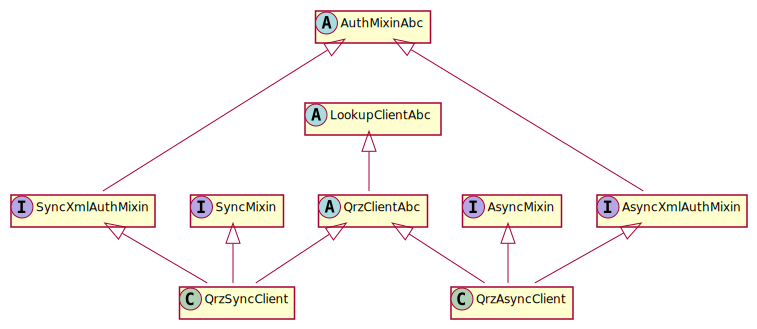
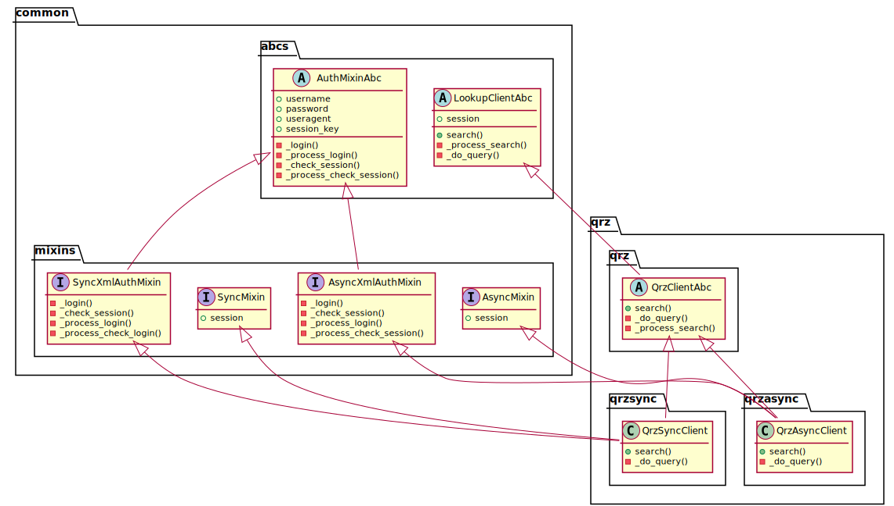

# Inheritance in CallsignLookupTools

CallsignLookupTools (CLT) is designed to be extremely modular, support sync and async,
and require minimal additional code when adding a new lookup source.
This comes at the cost of making the inheritance tree is fairly complex.

## Abstract Base Classes

All public-facing classes are based on the `LookupClientAbc`.
This class provides abstract methods and properties that every lookup source needs.
Each implementation of a lookup source should also have an ABC, like `QrzClientAbc`.
In this class, the post-processing of the parsed data happens, converting it from a Pydantic model to the output `CallsignData` object.
All other abstract methods are passed through this ABC to the implementation classes.

Classes that require authentication can use a mixin inherited from `AuthMixinAbc`.
At the moment, only XML APIs require authentication, so those are the only implementations.

## Mixins

CLT's mixins provide a way to add in methods and properties that are only required for a type of lookup source, e.g. XML or authenticated APIs, and/or for a type of implementation, like sync or async.

For example:
- `SyncMixin` provides sync implementations of functions and properties that will be used by all or most sync implementation classes
- `AsyncMixin` provides the same, but for async implementation classes
- `SyncXmlAuthMixin` and `AsyncXmlAuthMixin` provide functions for handling authentication with XML-/QRZ-style APIs

## Implementations

At the bottom of the inheritance tree are the implementations of the lookup source classes, e.g. `QrzSyncClient` and `QrzAsyncClient`.
These classes bring together the mixins and ABCs as needed to provide a full-featured, user-facing object to do callsign lookups with.
For most data sources, these classes should only require two methods to be defined.


## Class Diagrams

### Simplified

This UML diagram shows the basic structure of inheritance for a single lookup source.



### Complete

This UML diagram shows the structure of inheritance for a single lookup source, including properties, methods, and the files/modules each class is in.
It also includes a second lookup source (callook) to demonstrate how not all lookup sources need all mixins.



> *Note: these UML class diagrams are generated with [plantUML](https://plantuml.com/) from [inheritance.puml](./inheritance.puml).
> One of the easiest ways to regenerate the diagrams after editing is using the [plantUML VS Code extension](https://marketplace.visualstudio.com/items?itemName=jebbs.plantuml).
> Make sure you set the output format to `svg` and in the same directory, e.g. with these VS Code settings:*

```json
"plantuml.exportFormat": "svg",
"plantuml.exportOutDir": ".",
"plantuml.exportSubFolder": false
```
